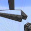

	

# Chunk Defense

Minecraft Chunk Defense for 1.19

This map is based on the [1.14.3 map](https://www.minecraftmaps.com/pve-maps/chunk-defense) by SnakeMasterEpic and has been
revamped by de_grote and I_Like_Cats__

## 🕹 How to Play
To play this map, simply follow these steps:
1. Click on the green button that says `Code`
	

	
Preview

	
	

1. Click `Download Zip`
	

	
Preview

	
	

1. Move this `.zip` to your Minecraft saves folder and extract it, you may delete the `.zip` afterwards
1. Open Minecraft and play the world! Have fun :)

## 💻 Developing
To modify this map or fix issues, follow the [`How to Play`](#🕹-how-to-play) guide and open the world folder in your editor. We recommend you use [`Visual Studio Code`](https://code.visualstudio.com/) because of it's extensions and support for Minecraft Datapacks.

### 🎨 Modifying
If you are planning on just modifying this datapack for your own needs, feel free to do whatever. 

### 🔨 Working on the project
TBA

## ✔ To-Do
These are planned features:
- [ ] Achievements
- [ ] End of map event
- [ ] Lobby book
- [ ] Semi playing guide
- [ ] Design icon.png
- [ ] Make lootboxes work
- [ ] Prices for upgrades
- [ ] Fix no saplings issue for nether, ocean and desert
- [ ] Generate book with mob rounds (spawnScript repo)

Ideas are welcome!